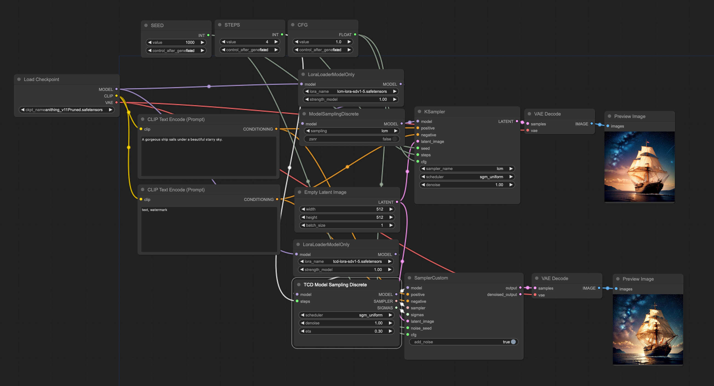
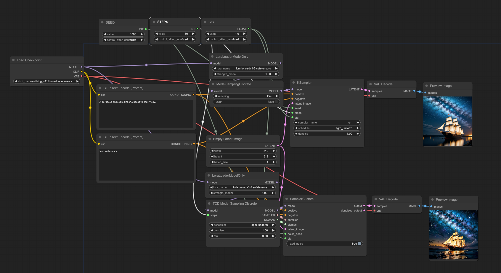

# ComfyUI-TCD

<p align="center">
<a href="./README.md">English</a> | <a href="./README.zh-CN.md">简体中文</a>
</p>

> 如果我的仓库对你起到了帮助，可以考虑给个 star。

该仓库是 [TCD 论文](https://github.com/jabir-zheng/TCD) 中提到的 TCD 采样器的 [ComfyUI](https://github.com/comfyanonymous/ComfyUI) 插件实现.

TCD 是一个受一致性模型启发（Consistency Models/Latent Consistency Models）提出的更加新颖的扩散模型蒸馏方法。和 LCM 一样，通过 TCD 可以将预训练好的扩散模型蒸馏成通过几步（1-8step）去噪就可以出结果的蒸馏模型。众所周知，使用了 LCM （LoRA）之后生成结果的图片清晰度和细节会比原模型差很多。而 TCD 相比 LCM 可以在相同的去噪步数内生成细节更丰富质量更好图片，并且 TCD 可以通过调节暴露出来的参数控制去噪过程中随机噪声的强弱来生成细节丰富程度不同的结果。

也就是：
- TCD 在相同步数的情况下生成图的细节比 LCM 更好会更好。
- TCD 可以通过参数控制细节的丰富程度。
- 此外 TCD 在 steps 较大时，生成的结果也会比 LCM 更好。

一些其他可能会帮助到你的仓库：

- [ComfyUI-TCD](https://github.com/JettHu/ComfyUI-TCD)：TCD 采样器 ComfyUI 实现，在和 LCM 相同性能的情况下生成比 LCM 细节更丰富的结果图
- [ComfyUI_TGate](https://github.com/JettHu/ComfyUI_TGate)：T-GATE ComfyUI 实现，在接受一部分细节损失的情况下 10-50% 的性能提升。
- [ComfyUI-ELLA](https://github.com/TencentQQGYLab/ComfyUI-ELLA)：ELLA 官方 ComfyUI 实现，基于大语言模型，让你的 SD 模型更准确地理解你的描述。

## :star2: 更新日志
- **[2024.4.28]** :rocket: 给官方的 [PR](https://github.com/comfyanonymous/ComfyUI/pull/3370) 已经在路上了.
- **[2024.4.28]** 发布仓库.

## 示例 workflow

[examples](./examples/) 文件夹下有使用节点的示例（workflow 截图里已经注入了完整的 workflow，可以直接 Load 图片或拖到 ComfyUI 空白的地方来导入 workflow）。TCD 和 LCM 的结果图在 [assets](./assets/) 文件夹中。

4 step 下的 LCM 和 TCD 结果图 workflow



30 step 下的 LCM 和 TCD 结果图 workflow




| | TCD 的生成结果 | LCM 的生成结果 |
| ---: | :---: | :---: |
| low steps |  |  |
| high steps |  |  |

上面的对比结果可以看出，不管在 steps 较少时还是在 steps 较大时，TCD 都能生成比 LCM 细节更好的结果，不再那么糊和平淡了。

## LoRAs

一些可以用 TCD Sampler 的 LoRA：

来自 [TCD 原团队](https://mhh0318.github.io/tcd/)的 TCD LoRAs：
- [TCD-SD15-LoRA.safetensors](https://huggingface.co/h1t/TCD-SD15-LoRA/blob/main/pytorch_lora_weights.safetensors)
- [TCD-SDXL-LoRA.safetensors](https://huggingface.co/h1t/TCD-SDXL-LoRA/blob/main/pytorch_lora_weights.safetensors)

很荣幸，来自字节 [Hyper-SD 团队](https://hyper-sd.github.io/) 的 Hyper-SD 1-Step Unified LoRAs 也使用 TCD Sampler，在 1-2 steps 的时候比另一个仓库生成结果更好：
- [Hyper-SD15-1step-lora.safetensors](https://huggingface.co/ByteDance/Hyper-SD/blob/main/Hyper-SD15-1step-lora.safetensors)
- [Hyper-SDXL-1step-lora.safetensors](https://huggingface.co/ByteDance/Hyper-SD/blob/main/Hyper-SDXL-1step-lora.safetensors)

## 安装
```bash
git clone https://github.com/JettHu/ComfyUI-TCD

# 或者是使用 ComfyUI-Manager
```

## 节点说明

### TCD Model Sampling Discrete

#### 输入
- **model**, `Load Checkpoint` 或者是其他节点加载的 SD 模型。

#### 配置参数
- **steps**: 去噪步数（和 `KSampler` 节点中的 `steps` 一样）。
- **scheduler**: 采样 scheduler （和 `KSampler` 节点中的 `scheduler` 一样）。
  - 我只保留了 `simple` 和 `sgm_uniform` 两个 scheduler。其中 `simple` 生成的 sigmas 结果和 diffusers 一样，然后 `sgm_uniform` 是 ComfyUI 作者在 lcm 的 workflow 样例中提到的另一个推荐 scheduler，两个都可以。
- **denoise**: 降噪幅度 （和 `KSampler` 节点中的 `denoise` 一样）。
- **eta**: 用来控制降噪过程中随机噪声强度（结果细节丰富程度）的参数（论文里叫`gamma`）。 当 `eta = 0` 时代表确定性抽样，当 `eta = 1` 代表完全随机抽样（具体效果要使用时试试看），调大 `steps` 和使用不同的 LoRA 都推荐微调这个参数，默认使用的是 0.3 。
